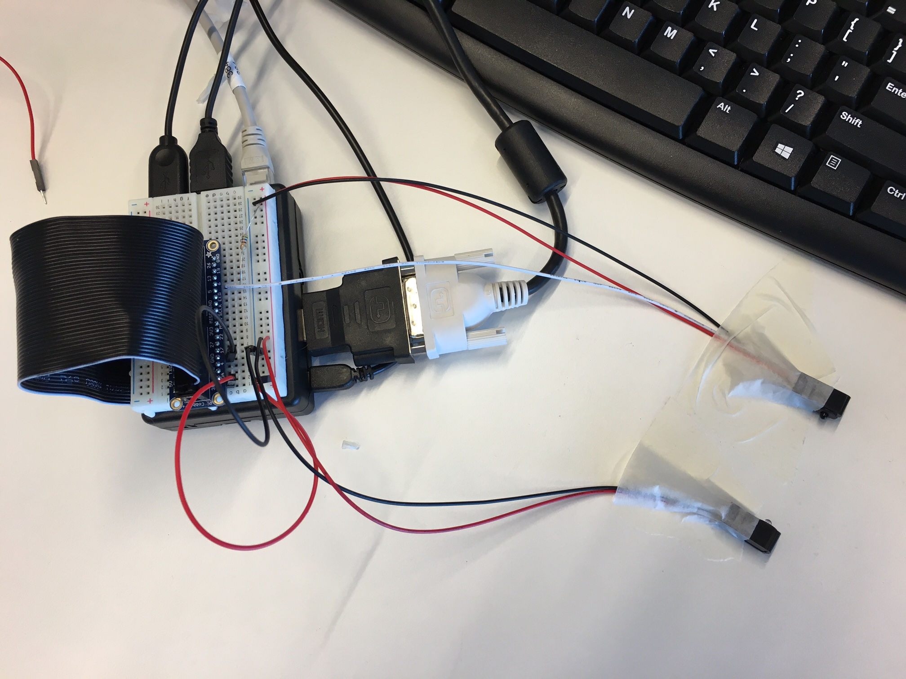

# Foosball Table Hack

Python project for the Raspberry Pi 3 to detect goals during Foosball Table matches.

## Hardware used:
- [Raspberry Pi 3 Model B](https://www.raspberrypi.org/products/raspberry-pi-3-model-b/)
- [IR Break Beam Sensor - 5mm LEDs](https://www.adafruit.com/products/2168)



### IR Breakbeams cable colors for cable extension:

| Type   | Cable Color origin | Cable Color extension |
|--------|--------------------|-----------------------|
| Beam   | Red                | Yellow                |
| Beam   | Black              | Green                 |
| Sensor | Red                | Brown                 |
| Sensor | Black              | Gray                  |
| Sensor | White              | White                 |

## Run
```
detect-goals.py
```

